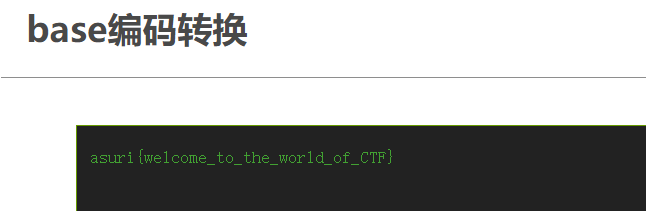
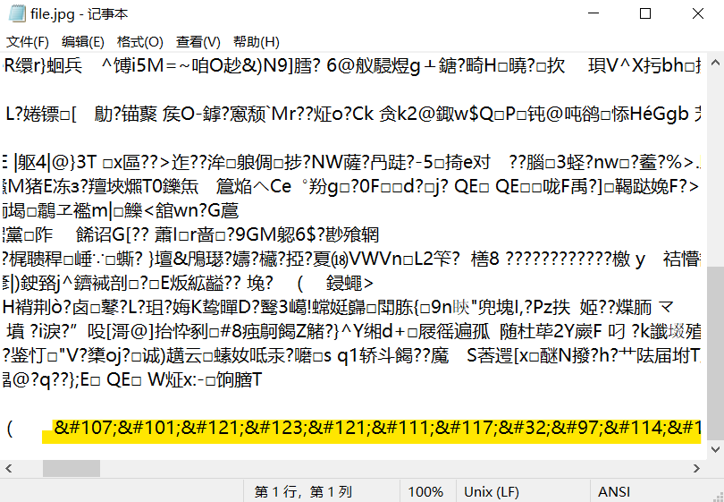

## Misc

### 简介

misc又称为杂项，所谓杂项就是你要会的很杂还要精，但也是最容易上手的一个，往往签到题（就是送分题哦~）都会放在misc这块。

因为misc涉及的知识很杂，所以呢题型也会有很多，比如：文件分析、图片隐写、编码解码、音频隐写等等，这一次呢就给大家介绍一下入门的一些知识。

### 编码解码

下面就介绍几种常见的编码

#### BASE全家桶

全家桶里有：`base64`,`base32`,`base16`等。一般最常见的就是这三个。

##### `Base64`

`Base64`是一种基于64个可打印字符来表示二进制数据的表示方法。由于2^6=64，所以每6个比特为一个单元，对应某个可打印字符。3个字节有24个比特，对应于4个`Base64`单元，即3个字节可由4个可打印字符来表示。
 在Base64中的可打印字符包括字母`A-Z`、`a-z`、数字`0-9`，这样共有62个字符。若原数据长度不是3的倍数时且剩下1个输入数据，则在编码结果后加2个`=`；若剩下2个输入数据，则在编码结果后加1个`=`。

比如用`base64`简单编码一串字符就得到了：`YXN1cml7d2VsY29tZV90b190aGVfd29ybGRfb2ZfQ1RGfQ==`，到这里一道无脑的签到题就出来了。这时我们想要拿到flag就只需要把这段字符丢到base编码转换的在线工具（百度一下，你值得拥有)，我们就可以轻轻松松拿到flag

(flag一般都是`xxx{xxxxxx}`格式的)

##### `Base32`

和`Base64`原理相似。由于 2^5=32，所以每5个比特为一个单元，对应某个可打印字符。5个字节有40个比特，对应于8个`Base32`单元，即5个字节可由8个可打印字符来表示。
 在`Base64`中的可打印字符包括字母`A-Z`、数字`2-7`，这样共有32个字符。若原数据长度不是5的倍数时且剩下1个输入数据，则在编码结果后加4个`=`；若剩下2个输入数据，则在编码结果后加3个`=`，以此类推。

比如上文的那个flag，用`base32`编码就会得到不一样的结果：`MFZXK4TJPN3WK3DDN5WWKX3UN5PXI2DFL53W64TMMRPW6ZS7INKEM7I=`

##### `Base16`

由于 2^4=16，所以每4个比特为一个单元，对应某个可打印字符。1个字节有8个比特，对应于8个`Base16`单元，即1个字节可由2个可打印字符来表示。
 在`Base64`中的可打印字符包括字母`A-F`、数字`0-9`，这样共有16个字符。

比如上文的那个flag，用`base16`编码就又会得到不一样的结果：

`61737572697B77656C636F6D655F746F5F7468655F776F726C645F6F665F4354467D`

#### ASCII

这是一个`ascii`码表，里面包括了大小写的英文字母、数字和一些常见符号

#### 摩斯密码

摩斯密码只有`·`和`-`，也可以使用01串表示，下面是摩斯密码表

### 隐写

隐写的种类和类型还蛮多的，我简单举几个例子

#### 0x01

（这是 [bugku](https://ctf.bugku.com/)上面的题，大家可以试着去做做看。）

下载 下来是一张照片

单从这张照片上看啥都没有，但你把它用记事本打开 后就会发现在最下面有一些很规整的字符串，有理由怀疑这个很可能就是我们要找有用信息，不过被编码过了。

这也是一个比较常见的编码叫**unicode**

>Unicode是一种字符编码方案，它为每种语言中的每个字符都设定了统一唯一的二进制编码，以实现跨语言、跨平台进行文本转换、处理的要求。
>
>Unicode编码有以下四种编码方式：
>源文本：The
>&#x [Hex]：The
>&# [Decimal]：The
>\U [Hex]：\U0054\U0068\U0065
>\U+ [Hex]：\U+0054\U+0068\U+0065

解码之后就得到了flag，这里我涂掉了，大家可以去试试哦~

#### 0x02

这是[XCTF攻防世界](https://adworld.xctf.org.cn/)的一道题，这道题对小白还是蛮有挑战性的，我在这边只介绍一个点（关于隐写的），其他的就不全部介绍了，大家可以去试试完整的解开这道题

附件是个压缩包，解压后得到一张图片

这个图片表面上看啥都没有，我们选择把它用010editor（招新群中的常用工具里面有，是一个16进制查看工具）打开

在文件的末端位置，出现红线这些信息，首先`50 4B 01 02`这是压缩源目录区标志，PK也都是出现在压缩文件中，下面的`hint.txt   to.png   to_do.png`则代表着这个确实是个压缩文件，并且里面含有这三个文件，接着直接改后缀名，解压就可以了

#### 0x04

先解压附件得到一个文件，遇事不决010editor，发现里面有一个音频文件，就改个后缀解压得到该音频文件

题目描述是要我们用眼睛看，那就用Audacity打开，找到频谱图就看到flag啦

### 建议

想学好misc的话就要多刷题，可以去[bugku](https://ctf.bugku.com/)或者[XCTF攻防世界](https://adworld.xctf.org.cn/)上刷题。misc是属于每个选手都很容易上手，因此想要在这个方向取得高分就要看很多题，记很多零碎的知识，还要把这些知识套用起来。萌新们，加油吧！
